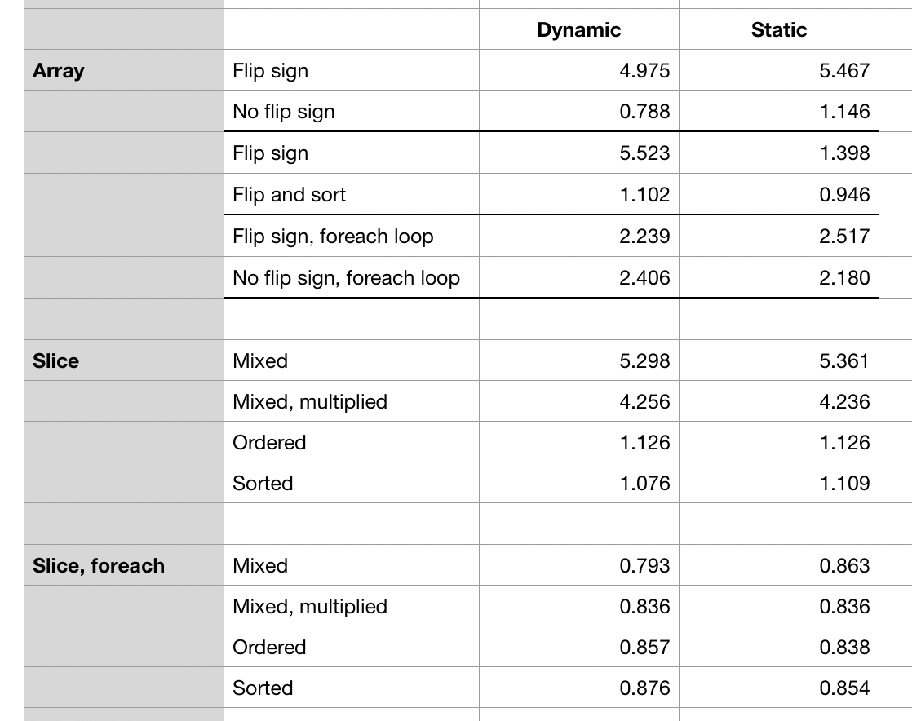

# Array and slice performance using different data
See // https://stackoverflow.com/questions/11227809/why-is-processing-a-sorted-array-faster-than-processing-an-unsorted-array?lq=1

## Performance table

GO version go1.13.6 darwin/amd64
